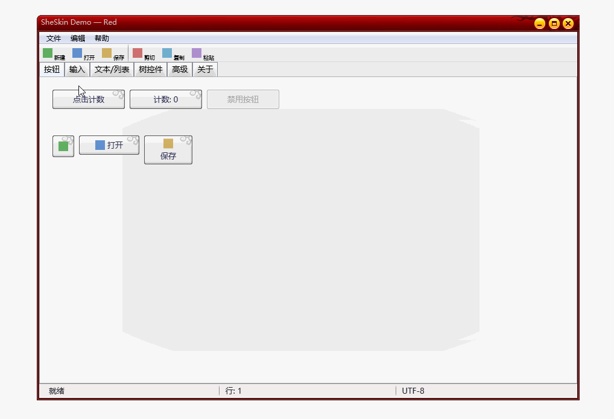
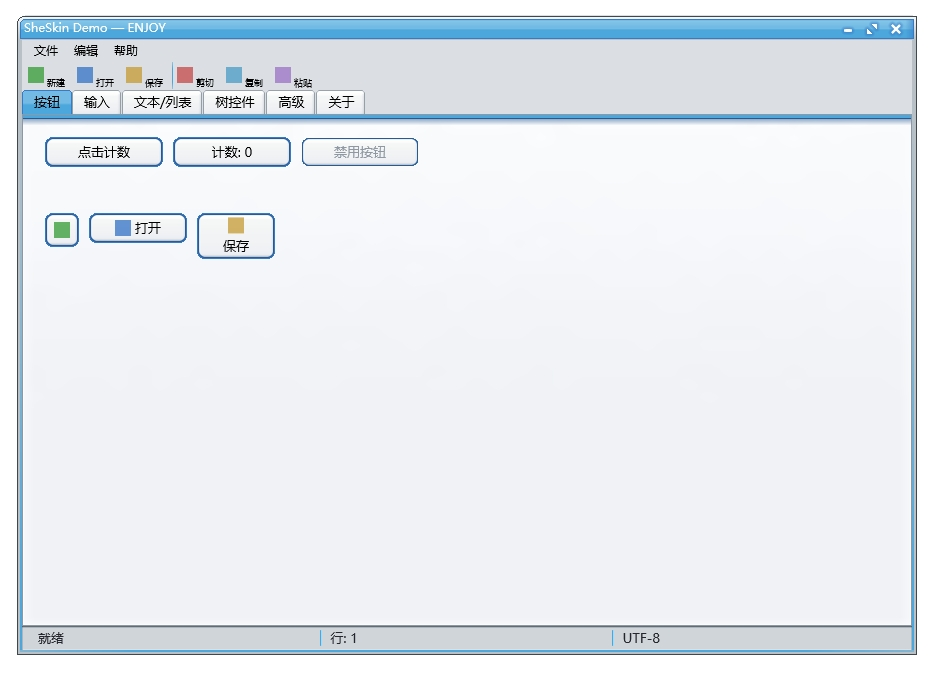
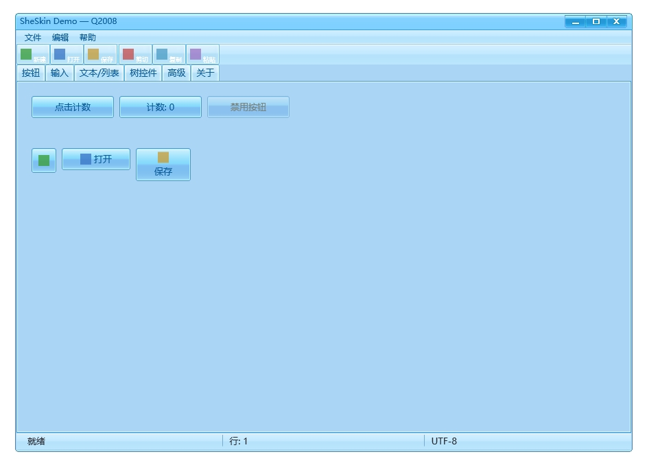
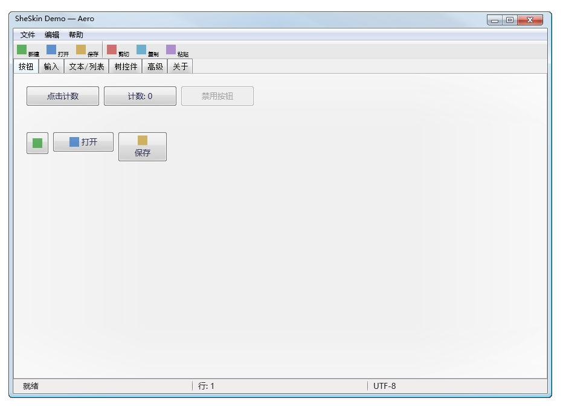

# SheSkin

**wxPython Direct2D 皮肤框架** — 基于 `WS_EX_LAYERED` 分层窗口 + Direct2D 硬件加速渲染的 wxPython 皮肤引擎。

## 预览






## 特性

- **GPU 加速渲染**：通过 Direct2D (DCRenderTarget) 绘制，DIBSection → `UpdateLayeredWindow` 管道，零 CPU 逐帧开销
- **分层窗口架构**：`WS_EX_LAYERED` + `UpdateLayeredWindow`，支持逐像素 Alpha 混合，实现异形窗口、半透明边框
- **9-Patch 拉伸**：皮肤贴图采用 9-patch (margin) 方式拉伸，任意尺寸控件均可正确渲染
- **自绘控件全集**：Button / Checkbox / RadioButton / EditBox / TextBox / ComboBox / SpinCtrl / TrackBar / ScrollBar / TabCtrl / ListBox / TreeCtrl / Progress / GroupBox / Label / HeaderCtrl / MenuBar / ToolBar / StatusBar / ContextMenu
- **皮肤热切换**：所有控件提供 `D2D*`（纯代码 fallback）和 `SkinAware*`（皮肤驱动）双版本
- **Win32 交互契约**：所有自绘按钮严格遵循 Win32 原生按钮行为（MouseUp 触发、Captured 期间保持 PRESSED、拖出取消）
- **5 款内置皮肤**：Aero / Asus / Q2008 / ENJOY / Red

## 架构概览

```
┌─────────────────────────────────────────────────────┐
│                  SheLayeredFrame                      │
│  (wx.Frame + WS_EX_LAYERED + WndProc 子类化)         │
├─────────────────────────────────────────────────────┤
│  Render Pipeline:                                    │
│  Direct2D DCRenderTarget → DIBSection →              │
│  UpdateLayeredWindow (per-frame, V-synced)           │
├──────────┬──────────┬──────────┬─────────────────────┤
│ TitleBar │ MenuBar  │ ToolBar  │ Client Area          │
│ (skin)   │ (skin)   │ (skin)   │ (D2D Controls)      │
├──────────┴──────────┴──────────┼─────────────────────┤
│                                │ StatusBar (skin)     │
└────────────────────────────────┴─────────────────────┘
```

## 快速开始

### 安装依赖

```bash
pip install wxPython pyd2d numpy
```

### 运行 Demo

```bash
python demo_app.py
```

### 最小示例

```python
import wx
from sheskin import SheLayeredFrame
from sheskin.controls import SkinAwareButton, SkinContext

app = wx.App(False)
frame = SheLayeredFrame('Aero', title='Hello SheSkin', size=(400, 300))

if frame.skin and frame.skin._loaded:
    ctx = SkinContext(frame.skin)
    cx, cy, cw, ch = frame.get_client_rect()
    btn = SkinAwareButton((cx + 20, cy + 20, 120, 32), "Click Me", ctx,
                           on_click=lambda: print("clicked!"))
    frame.register_d2d_control(btn)

frame.Show()
app.MainLoop()
```

## 项目结构

```
sheskin/
├── __init__.py            # 导出 SheSkin, SheLayeredFrame, SheMenuBar
├── frame.py               # SheLayeredFrame — 核心分层窗口
├── skin.py                # SheSkin — 皮肤加载器
├── skin_data.py           # 预提取的皮肤数据（blocks, properties）
├── layout.py              # 控件槽位布局定义 + CONTROL_SLOTS 映射
├── config.py              # 框架级常量（颜色、尺寸、字体默认值）
├── block.py               # Block 数据结构 + 9-patch 解析
├── bitmap.py              # 位图加载 + ColorKey 透明处理
├── d2d_render.py          # Direct2D 渲染函数（draw_block, draw_text）
├── brush_cache.py         # D2D Brush 缓存
├── draw_context.py        # DrawContext — 封装 RT + Factory
├── draw_node.py           # DrawNode — 渲染树节点
├── geometry_hittest.py    # 几何命中测试
├── titlebar.py            # SheTitleBar — 标题栏自绘
├── menubar.py             # SheMenuBar — 菜单栏自绘
├── controls/
│   ├── __init__.py        # 控件统一导出
│   ├── base_control.py   # SheControl 基类
│   ├── skin_context.py   # SkinContext — 皮肤属性查询上下文
│   ├── layout.py         # HBox / VBox 布局系统
│   ├── button.py         # D2DButton / SkinAwareButton
│   ├── checkbox.py       # D2DCheckbox / SkinAwareCheckbox
│   ├── radio.py          # D2DRadioButton / SkinAwareRadioButton / RadioGroup
│   ├── editbox.py        # D2DEditBox / SkinAwareEditBox
│   ├── textbox.py        # D2DTextBox / SkinAwareTextBox
│   ├── combobox.py       # D2DComboBox / SkinAwareComboBox
│   ├── spinctrl.py       # D2DSpinCtrl / SkinAwareSpinCtrl
│   ├── trackbar.py       # D2DTrackBar / SkinAwareTrackBar
│   ├── scrollbar.py      # D2DScrollBar / SkinAwareScrollBar
│   ├── tabctrl.py        # D2DTabCtrl / SkinAwareTabCtrl
│   ├── listbox.py        # D2DListBox / SkinAwareListBox
│   ├── treectrl.py       # D2DTreeCtrl / SkinAwareTreeCtrl
│   ├── groupbox.py       # D2DGroupBox / SkinAwareGroupBox
│   ├── label.py          # D2DLabel / SkinAwareLabel
│   ├── progress.py       # D2DProgress / SkinAwareProgress
│   ├── headerctrl.py     # D2DHeaderCtrl / SkinAwareHeaderCtrl
│   ├── bitmapbutton.py   # D2DBitmapButton / SkinAwareBitmapButton
│   ├── menu.py           # D2DContextMenu / SkinAwareContextMenu
│   ├── toolbar.py        # D2DToolBar / SkinAwareToolBar
│   └── statusbar.py      # D2DStatusBar / SkinAwareStatusBar
skins/                     # 皮肤资源（PNG 位图 + JSON 属性）
├── Aero.png / Aero.json
├── Asus.png / Asus.json
├── Q2008.png / Q2008.json
├── ENJOY.png / ENJOY.json
└── Red.png / Red.json
```

## pyd2d — Direct2D Python 绑定（本项目改造版）

本项目使用经过改造的 pyd2d，位于本仓库 `pyd2d-main/` 目录。**必须从本目录编译安装，不可使用 PyPI 上的原版 pyd2d**，否则部分 API 不可用。

### 前置条件

- Windows 10/11
- Python 3.9+
- Cython >= 3.0
- C++ 编译器（MSVC，随 [Visual Studio Build Tools](https://visualstudio.microsoft.com/visual-cpp-build-tools/) 安装，需勾选"使用 C++ 的桌面开发"）

### 编译安装

```bash
cd pyd2d-main
pip install setuptools cython
pip install .
```

pyd2d 链接的系统库：`d2d1`、`dwrite`、`ole32`、`windowscodecs`，均为 Windows 系统自带，无需额外安装。

### 与原版差异

本改造版基于 [merlinz01/pyd2d](https://github.com/merlinz01/pyd2d)（MIT License），新增/修改了以下能力以支持皮肤框架渲染：

- DCRenderTarget 相关接口扩展
- 九宫格 (Nine-Patch) 绘制支持
- 额外的 DirectWrite 文本布局控制

**原作者项目：** https://github.com/merlinz01/pyd2d

## 皮肤系统详解

### 皮肤数据结构

每个皮肤由三部分组成：

| 组成 | 说明 |
|------|------|
| **Bitmap** | 一张 PNG 精灵图，包含所有控件的贴图切片 |
| **Blocks** | 每个切片在精灵图中的位置、尺寸、9-patch margin、ColorKey |
| **Properties** | 控件的文本颜色、字体、尺寸等属性值 |

#### Block 数据格式

```python
# slot → [bg_left, bg_top, bg_width, bg_height, bg_color_key,
#          fg_left, fg_top, fg_width, fg_height, fg_color_key,
#          margin_left, margin_top, margin_right, margin_bottom,
#          draw_flags, alignment, offset_x, offset_y]
0: [0, 0, 337, 28, 16711935, 0, 0, 0, 0, 0, 8, 0, 8, 0, 0, 0, 0, 0]
```

- **bg_***: 背景层（9-patch 拉伸区域）
- **fg_***: 前景层（居中绘制，如按钮上的图标）
- **margin_***: 9-patch 四边固定区域
- **bg_color_key**: 洋红色 `0xFF00FF` 表示透明

#### Properties 数据格式

```python
'PushButton': {
    'text_color_n': ('color', (0, 0, 0)),       # normal 状态文本颜色
    'text_color_h': ('color', (255, 255, 255)), # hover 状态文本颜色
    'font': ('font', -13, 0, 400, 0, '宋体', 0), # (height, width, weight, italic, face, charset)
}
```

### 槽位映射 (CONTROL_SLOTS)

每个控件类型在 `layout.py` 中定义了槽位映射，将逻辑状态映射到精灵图中的具体切片：

```python
CONTROL_SLOTS['PushButton'] = {
    'button': {'normal': 71, 'hover': 72, 'default': 73, 'pressed': 74, 'disabled': 75},
    'text_color_n': ..., 'font': ...,
}
```

`SkinAware*` 控件通过 `SkinContext` 查询槽位，从精灵图中提取对应切片进行渲染。

### 控件槽位总览

| 控件 | 子类别名 | 槽位范围 | 状态数 |
|------|---------|---------|--------|
| 标题栏 | NormalWindow | 0-27 | active/inactive |
| 菜单栏 | MenuBar | 48-65 | normal/hover/pressed/disabled |
| 按钮 | PushButton | 71-75 | normal/hover/default/pressed/disabled |
| 复选框 | CheckBox | 76-90 | normal/hover/default/pressed/disabled |
| 单选按钮 | RadioButton | 91-100 | normal/hover/default/pressed/disabled |
| 分组框 | GroupBox | 101-104 | normal/disabled |
| 状态栏 | StatusBar | 112-116 | normal/disabled |
| 工具栏 | ToolBar | 105-111 | normal/default/pressed/disabled |
| 滚动条 | ScrollBar | 116-148 | normal/default/pressed/disabled |
| 进度条 | Progress | 154-165 | normal/disabled |
| 表头 | HeaderCtrl | 150-153 | normal/default/pressed/disabled |
| 选项卡 | TabCtrl | 166-192 | normal/default/pressed/disabled |
| 调节器 | SpinCtrl | 194-209 | normal/default/pressed/disabled |
| 下拉框 | ComboBox | 214-218 | normal/default/hover/pressed/disabled |
| 滑块 | TrackBar | 219-251 | normal/default/hover/pressed/disabled |
| 边框 | CtrlBorder | 210-213 | normal/default/hover/pressed/disabled |
| 窗口背景 | WindowBg | 271 | normal |


### 九宫格绘制机制

#### 九宫格的含义

九宫格（Nine-Patch）是皮肤绘制核心机制。每个 block 的 margin 四值 `[left, top, right, bottom]` 将源图像切分为 9 个区域：

```
┌────┬──────────────┬────┐
│ LT │     CT       │ RT │  ← top margin
├────┼──────────────┼────┤
│ LC │     CC       │ RC │  ← 中间可拉伸区域
├────┼──────────────┼────┤
│ LB │     CB       │ RB │  ← bottom margin
└────┴──────────────┴────┘
  ↑         ↑          ↑
left     center     right
margin   margin     margin
```

- **角区域**（LT/RT/LB/RB）：固定大小，不拉伸不平铺，直接绘制
- **边区域**（CT/CB/LC/RC）：可拉伸或平铺，由 `draw_flags` 控制
- **中心区域**（CC）：可拉伸或平铺，由 `draw_flags` 控制

#### draw_flags 编码

`draw_flags` 是 5 位十进制编码，每位对应一个区域的绘制模式：

```
值 10001 → [top=1, left=0, center=0, right=0, bottom=1]
  1 = 平铺（tile），0 = 拉伸（stretch）
```

| 位 | 区域 | 0=拉伸 | 1=平铺 |
|----|------|--------|--------|
| 万位 | top (CT) | 整条拉伸 | 重复平铺 |
| 千位 | left (LC) | 整条拉伸 | 重复平铺 |
| 百位 | center (CC) | 整条拉伸 | 重复平铺 |
| 十位 | right (RC) | 整条拉伸 | 重复平铺 |
| 个位 | bottom (CB) | 整条拉伸 | 重复平铺 |

**角区域永远不拉伸不平铺**，这是九宫格的基本原则——角保持原始像素，边和中心才根据目标尺寸调整。

#### 前景与背景

每个 block 包含前景（fg）和背景（bg）两个图像区域：

- **背景**：先绘制，填充整个目标矩形
- **前景**：后绘制，在背景内部区域按 `alignment` 对齐放置

前景的定位由 `alignment`（0=居中,1=左,2=右,3=上,4=下）和 `offset_x/offset_y` 控制。


## 自定义皮肤控件指南

### 方式一：创建新皮肤（推荐）

1. **准备精灵图**：创建一张 PNG 图片，按槽位排列所有控件切片
2. **添加皮肤数据**：在 `skin_data.py` 中添加新皮肤条目：

```python
SKIN_MY_SKIN = {
    "name": 'MySkin',
    "bitmap": {
        "width": 400, "height": 300, "bpp": 24,
        "png_file": 'MySkin.png',
    },
    "blocks": {
        0: [0, 0, 400, 30, 16711935, ...],  # 顶部边框
        # ... 其他槽位
    },
    "properties": {
        'NormalWindow': {
            'text_color_n': ('color', (0, 0, 0)),
            'font': ('font', -12, 0, 400, 0, 'Microsoft YaHei', 0),
        },
        'PushButton': {
            'text_color_n': ('color', (255, 255, 255)),
            'font': ('font', -12, 0, 700, 0, 'Microsoft YaHei', 0),
        },
        # ... 其他控件属性
    },
}

# 在 _SKIN_MAP 中注册
_SKIN_MAP['MySkin'] = SKIN_MY_SKIN
```

3. **放置资源文件**：将 `MySkin.png` 和 `MySkin.json` 放入 `skins/` 目录

### 方式二：自定义单个控件

每个 `SkinAware*` 控件在无对应皮肤贴图时，自动 fallback 到纯代码渲染（`D2D*` 版本的硬编码颜色）。因此你可以：

1. **仅覆盖部分控件**：只为需要的控件提供贴图，其余自动 fallback
2. **修改 fallback 颜色**：编辑 `config.py` 中的颜色常量

```python
# config.py — 修改全局 fallback 颜色
BUTTON_COLORS = {
    'normal': {'bg': (0.15, 0.56, 0.92, 1.0), 'fg': (1.0, 1.0, 1.0, 1.0), ...},
    'hover':  {'bg': (0.18, 0.60, 0.96, 1.0), ...},
    ...
}
```

### 方式三：创建全新控件类型

1. **继承 `SheControl`**：

```python
from sheskin.controls.base_control import SheControl

class MyWidget(SheControl):
    NORMAL = 0
    HOVER = 1
    PRESSED = 2
    DISABLED = 3

    def __init__(self, rect, text="", on_click=None):
        super().__init__(rect, text)
        self._on_click = on_click
        self._captured = False

    def hit_test(self, pt):
        x, y, w, h = self._rect
        return x <= pt[0] <= x + w and y <= pt[1] <= y + h

    def on_mouse_down(self, pt):
        self._captured = True
        return True

    def on_mouse_up(self, pt):
        if not self._captured:
            return False
        self._captured = False
        if self.hit_test(pt) and self._on_click:
            self._on_click()
        return True

    def draw(self, ctx, client_rect):
        # 纯代码渲染
        ...
```

2. **创建皮肤化版本**：

```python
from sheskin.controls.skin_context import SkinContext

class SkinAwareMyWidget(MyWidget):
    def __init__(self, rect, text, skin_context, on_click=None):
        super().__init__(rect, text, on_click=on_click)
        self._ctx = skin_context

    def draw(self, ctx, client_rect):
        # 尝试使用皮肤贴图
        slot = self._ctx.get_block(MY_SLOT)
        if slot and not is_block_empty(slot):
            d2d_draw_block(ctx.rt, self._ctx.skin_img, slot, self._rect, ...)
        else:
            # fallback 到纯代码渲染
            super().draw(ctx, client_rect)
```

3. **注册到 frame**：

```python
widget = SkinAwareMyWidget((0, 0, 100, 30), "Hello", ctx, on_click=callback)
frame.register_d2d_control(widget)
```

### 控件交互规范

所有自绘按钮类控件必须遵循 Win32 原生按钮行为契约：

| 行为 | 规范 |
|------|------|
| **触发时机** | MouseUp 时触发（非 MouseDown），用户可拖出取消 |
| **Captured 视觉** | 鼠标按住期间始终显示 PRESSED，不管鼠标在区域内还是区域外 |
| **状态恢复** | MouseUp 中无论鼠标位置，只要状态变化就返回 `True` 触发重绘 |
| **`_captured` 标志** | MouseDown 置 True，MouseUp / MouseLeave 置 False |

## 测试

```bash
pip install pytest
python -m pytest test/ -q
```

## 依赖

| 依赖 | 用途 |
|------|------|
| [wxPython](https://wxpython.org/) | GUI 框架，提供窗口系统和事件循环 |
| [pyd2d](https://github.com/merlinz01/pyd2d) | Direct2D / DirectWrite Python 绑定（本项目改造版，见上方说明） |
| [numpy](https://numpy.org/) | DIBSection 像素缓冲区操作 |

## 系统要求

- Windows 10 / 11
- Python 3.9+
- 支持 DirectX 11 的 GPU（Direct2D 硬件加速）

## 许可证

MIT License

## 声明

本项目 README 及代码主体由 AI 辅助生成。
